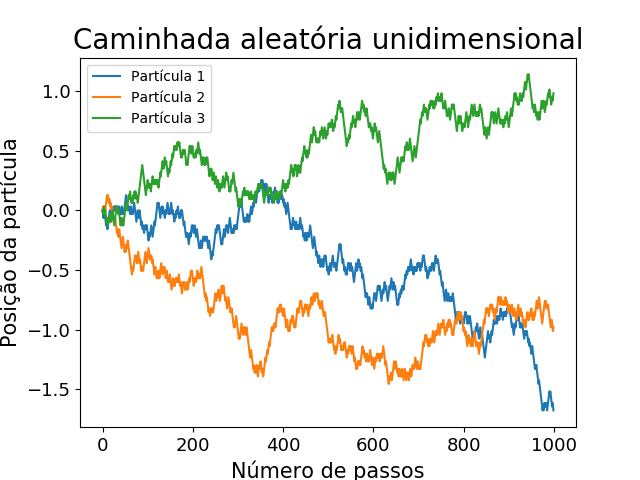

# Simulação computacional de processos estocásticos

## Objetivo

O objetivo deste repositório é expor simulações de sistemas estudados na disciplina de dinâmica estocástica do programa de pós graduação em física da UFPB.

## Sistemas simulados
- Movimento Browniano;

## Introdução
O movimento browniano é o movimento aleatório de partículas minúsculas suspensas em um fluido. O resultado destes movimentos errantes advém de inúmeras colisções que as partículas sofrem.

## Caminhada aleatória

Na caminhada aleatória unidimensional, a partícula pode executar um passo para a esquerda ou para a direita com igual probabilidade. Na imagem abaixo podemos observar este processo realizado por três partículas diferentes, todas elas iniciando na origem.

## Processos de Wiener

Propriedades matemáticas do movimento browniano unidimensional foram estudadas pelo matemático americano Norbert Wiener. Neste processo, o movimento é modelado considerando o tempo como uma variável contínua. As duas principais características deste processo é a estacionariedade e incrementos independentes. Este tipo de processo encontra muitas aplicações nos mais variados campos, por exemplo, economia, física quântica, biologia, dentre outros.

### Dedução da distribuição de probabilidade do processo de wiener

Equação de Fokker-Planck para o processo de Wiener

$\frac{∂}{∂t} P(\omega, t|\omega_0, t_0) = \frac{1}{2} \frac{∂^2}{∂\omega^2} P(\omega, t|\omega_0, t_0)$  

#

Função característica:

$\phi(s,t) = \int d\omega P(\omega, t|\omega_0, t_0) e^{is\omega}$ 

$\frac{∂}{∂t} \phi(s,t) = \frac{∂}{∂t} [\int d\omega P(\omega, t|\omega_0, t_0) e^{is\omega}]$